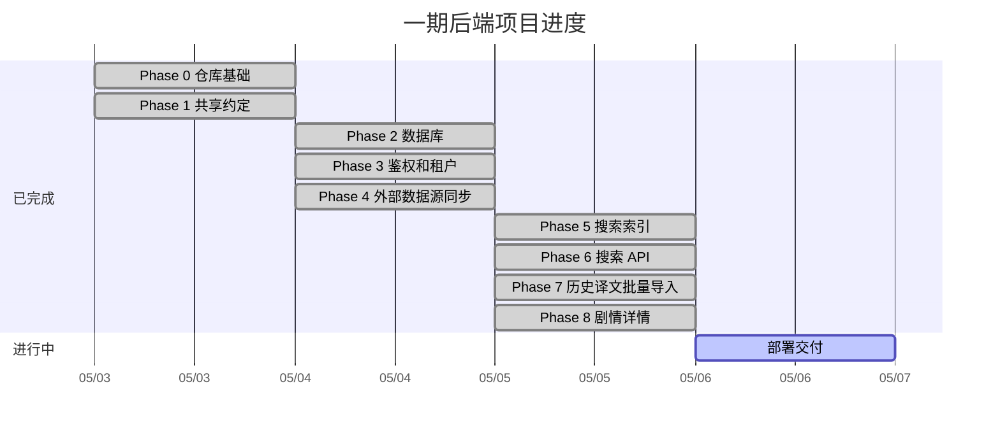

# sekai-platform

PJS 字幕组语言资产检索平台。

## 项目简介

sekai-platform 用于整理、检索和查看字幕组积累的语言资产。一期聚焦剧情原文、历史译文、翻译版本和行级搜索能力，让组员可以在同一平台中定位剧情、查看原文、检索既有译文，并按字幕组租户隔离管理译文资产。

平台当前以 Project SEKAI 剧情资产为主要对象。原文来自 Moe Sekai / Exmeaning 公共数据源，译文通过导入接口进入平台。原文作为全平台共享资产，译文和翻译版本按租户隔离。

## 当前状态

一期后端核心能力已完成，部署交付准备中。



## 核心能力

- 原文同步：从 Moe Sekai / Exmeaning 同步活动剧情、主线剧情、卡面剧情、区域对话和特殊剧情原文。
- 历史译文导入：导入字幕组既有 JSON 译文资产，并保留翻译版本和署名信息。
- 统一搜索：检索全平台共享原文和当前租户译文，结果定位到剧情、章节和具体行。
- 剧情详情：查看剧情、原文行、翻译版本和译文行。
- 租户隔离：不同字幕组的译文、翻译版本和导入结果相互隔离。
- 后端部署基线：提供 Docker Compose 本地环境、服务器 Compose 基线和 GitHub Actions 构建部署入口。

## 系统组成

一期采用 ASP.NET Core 微服务架构，使用 Docker Compose 组织本地和服务器运行环境。

| 组件 | 职责 |
|---|---|
| API Service | 对外 API 入口，负责鉴权、参数校验和服务编排 |
| Auth Service | 登录、租户选择和用户会话 |
| Asset Service | 剧情、原文、译文、翻译版本和导入 |
| Search Service | 搜索查询和 Elasticsearch 索引维护 |
| Sync Worker | 定时同步外部原文数据 |
| PostgreSQL | 主数据存储 |
| Elasticsearch | 全文检索 |

## 本地运行

本地依赖：

- .NET SDK 10
- Docker Desktop 或兼容 Docker Compose v2 的运行环境
- 本地 .NET 工具通过 `dotnet tool restore` 安装

复制本地配置样例：

```bash
cp .env.example .env
```

生成本地内部服务 token 密钥：

```bash
scripts/generate-internal-auth-keys.sh >> .env
```

启动基础设施和服务容器：

```bash
docker compose up --build
```

API Service 健康检查：

```bash
curl http://localhost:8080/health
```

运行部署冒烟测试：

```bash
SMOKE_PASSWORD=your-local-login-password scripts/deployment-smoke.sh
```

常用工程命令：

```bash
dotnet build SekaiPlatform.sln
dotnet test tests/integration-tests/SekaiPlatform.IntegrationTests.csproj
```

## 文档入口

- API 文档维护在 Apifox 项目 `8210187`，文档站：<https://sekai-platform.apifox.cn/>。
- [总体设计](docs/design/index.md)
- [接口草案](docs/design/interface.md)
- [数据模型](docs/design/data-model.md)
- [外部数据源](docs/design/external-api.md)
- [安全模型](docs/design/security-model.md)
- [一期后端交付状态](docs/plan/first-release.md)
- [Docker Compose 与 GitHub Actions 部署说明](docs/deploy/docker-compose-github-actions.md)

## 约定

- 当前仓库不维护本地 OpenAPI 源文件，正式 API 文档以 Apifox 为准。
- 涉及架构、数据模型、接口或关键业务流程的改动，先查看 `docs/design/` 下的相关设计文档。
- 涉及后端交付状态和剩余部署事项的改动，先查看 `docs/plan/`。
