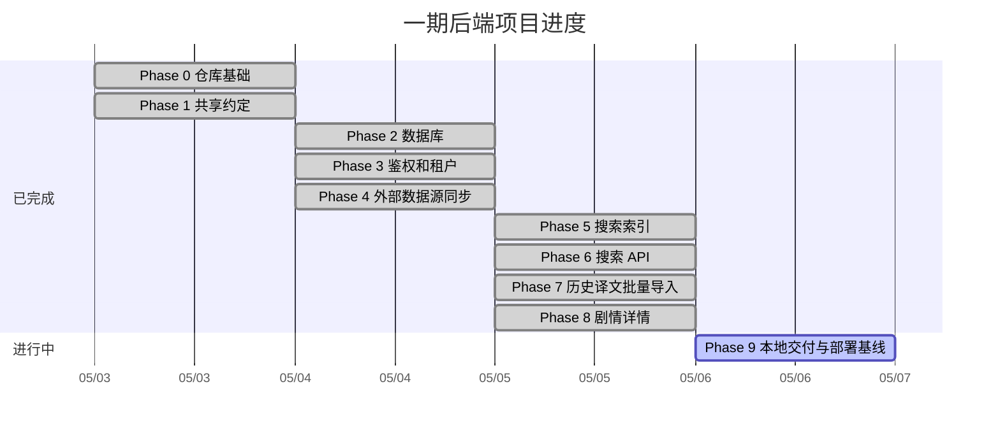

# sekai-platform

PJS 字幕组语言资产检索平台。

当前已完成 Phase 8 剧情详情。一期聚焦后端能力：原文同步、历史译文批量导入、租户隔离检索和剧情详情 API。

## 项目进度



## 本地依赖

- .NET SDK 10
- Docker Desktop 或兼容 Docker Compose v2 的运行环境
- 本地 .NET 工具通过 `dotnet tool restore` 安装

## 本地启动

复制本地配置样例：

```bash
cp .env.example .env
```

生成本地内部服务 token 密钥：

```bash
scripts/generate-internal-auth-keys.sh >> .env
```

启动基础设施和服务容器：

```bash
docker compose up --build
```

API Service 在 Docker Compose 的 Development 环境中默认会自动执行 EF Core migration 并写入 seed 数据。可在 `.env` 中关闭：

```bash
DATABASE_AUTO_MIGRATE=false
DATABASE_SEED=false
```

默认 seed 数据：

| 类型 | QQ 号 | 角色 |
|---|---|---|
| 超级管理员用户 | `1650121748` | `super_admin` |

默认不写入可登录密码。如需为本地 seed 用户写入密码哈希，在 `.env` 中设置：

```bash
SEED_ADMIN_PASSWORD=your-local-admin-password
```

默认端口：

| 服务 | 地址 |
|---|---|
| API Service | http://localhost:8080 |
| PostgreSQL | localhost:5432 |
| Elasticsearch | http://127.0.0.1:9200 |

API Service 健康检查：

```bash
curl http://localhost:8080/health
```

内部服务健康聚合：

```bash
curl http://localhost:8080/api/internal-services/health
```

## 原文同步

Phase 4 已实现 Moe Sekai / Exmeaning 外部数据源同步，覆盖活动剧情、主线剧情、卡面剧情、区域对话和特殊剧情。

手动同步通过 API Service 触发，要求已登录、已选择租户，且当前用户是该租户的 `admin` 或 `super_admin`：

```bash
curl -X POST http://localhost:8080/api/sync/jobs \
  -H 'Authorization: Bearer <access-token>' \
  -H 'Content-Type: application/json' \
  -d '{"source":"moesekai"}'
```

查询同步任务：

```bash
curl http://localhost:8080/api/sync/jobs \
  -H 'Authorization: Bearer <access-token>'
```

Sync Worker 会每天自动执行一次原文同步，默认本地时间 `04:00`。可通过配置 `MoeSekai:ScheduledLocalTime` 调整。

同步结果写入 `story_groups`、`stories`、`story_source_lines` 和 `sync_jobs`。同步成功后会请求 Search Service 刷新对应剧情的原文和译文索引。部分 scenario 下载或解析失败时会记录失败样本并继续处理其他剧情；如果没有任何 scenario 成功同步，则任务标记为失败。

## 搜索索引

Phase 5 已实现 Elasticsearch 统一索引 `sekai-language-assets-v1`。Docker Compose 使用 `deploy/elasticsearch/Dockerfile` 构建 Elasticsearch 8.15.3，并安装 `analysis-smartcn`、`analysis-kuromoji` 和 `analysis-icu`。

Search Service 提供内部维护接口 `POST /internal/search/index/rebuild`，用于按 `all`、`source` 或 `translation` 范围重建索引。该接口不通过 API Service 对外暴露，调用方必须携带非对称签名的内部 token；安全模型见 [安全模型](docs/design/security-model.md)。

内部 token 的签发私钥不放在仓库配置中。Docker Compose 本地启动前需要通过 `.env` 注入 `API_SERVICE_INTERNAL_PRIVATE_KEY`、`ASSET_SERVICE_INTERNAL_PRIVATE_KEY`、`SYNC_WORKER_INTERNAL_PRIVATE_KEY` 及对应 public key；生产环境必须使用部署平台的 secret 管理机制注入并轮换。

如果 Apple Silicon / M 系列机器上 Elasticsearch 因 JVM `SIGILL` 退出，可在 `.env` 中改为：

```bash
ELASTICSEARCH_JAVA_OPTS=-Xms512m -Xmx512m -XX:UseSVE=0
ELASTICSEARCH_CLI_JAVA_OPTS=-XX:UseSVE=0
```

当前 Docker Compose 中 5 个 .NET 服务固定为 `linux/amd64` 平台，用于规避本机 Docker Desktop 下 .NET 10 ARM64 SDK 容器在构建阶段偶发 `Illegal instruction` 的问题。Dockerfile 本身不设置硬件指令兼容开关，避免影响其他部署环境。

如果本机已有进程占用 IPv4 `localhost:8080`，可以使用 IPv6 loopback 访问 API Service：

```bash
curl -g 'http://[::1]:8080/health'
```

## 搜索 API

Phase 6 已实现公开搜索入口 `GET /api/search`。该接口要求用户已登录并已选择当前租户，搜索范围包括全平台共享原文和当前租户译文。

请求示例：

```bash
curl 'http://localhost:8080/api/search?keyword=こんにちは&page=1&page_size=20' \
  -H 'Authorization: Bearer <access-token>'
```

响应按行返回搜索结果：

```json
{
  "items": [
    {
      "asset_type": "source",
      "text": "こんにちは",
      "highlight_text": "<mark>こんにちは</mark>",
      "speaker": "ミク",
      "line_no": 1,
      "story_id": 301,
      "story_title": "第1話",
      "story_type": "event_story",
      "story_group_id": 201,
      "story_group_title": "テストイベント",
      "source_line_id": 401,
      "translation_version_id": null
    }
  ],
  "total": 1,
  "page": 1,
  "page_size": 20
}
```

一期只对原文/译文正文进行关键词匹配；剧情、剧情集和说话人作为结果上下文返回。`page_size` 范围为 1 到 100，且结果窗口 `from + page_size` 不得超过 10000。

## 历史译文导入

Phase 7 已实现公开导入入口 `POST /api/import/translation-versions`。该接口要求用户已登录、已选择当前租户，且当前用户是该租户的 `admin` 或 `super_admin`。

请求只接受 JSON，一次可导入多个剧情的译文版本。每个导入项通过 `story_type + scenario_id` 匹配剧情，通过 `line_no` 匹配原文行；同一租户同一剧情每次导入都会创建新的翻译版本。

```bash
curl -X POST http://localhost:8080/api/import/translation-versions \
  -H 'Authorization: Bearer <access-token>' \
  -H 'Content-Type: application/json' \
  -d '{
    "items": [
      {
        "story_type": "event_story",
        "scenario_id": "scenario_event_001",
        "title": "历史译文",
        "lines": [
          { "line_no": 1, "text": "译文文本" }
        ]
      }
    ]
  }'
```

响应返回本次创建的翻译版本和行数：

```json
{
  "items": [
    {
      "story_type": "event_story",
      "scenario_id": "scenario_event_001",
      "story_id": 123,
      "translation_version_id": 456,
      "version_no": 1,
      "line_count": 1
    }
  ],
  "total_versions": 1,
  "total_lines": 1
}
```

导入请求按整批事务处理，任意剧情或行校验失败时整批不写入。导入成功后会刷新对应翻译版本的 translation 搜索索引，译文可通过 `/api/search` 在当前租户内检索。

## 剧情详情

Phase 8 已实现 Assets 读接口。接口要求用户已登录并已选择当前租户，原文剧情为全平台共享数据，翻译版本和翻译行只返回当前租户内的数据。

支持的公开接口：

| 方法 | 路径 | 说明 |
|---|---|---|
| GET | `/api/story-types` | 查询支持的剧情类型 |
| GET | `/api/story-groups` | 查询剧情集列表 |
| GET | `/api/story-groups/{storyGroupId}` | 查询剧情集详情 |
| GET | `/api/stories` | 查询剧情列表 |
| GET | `/api/stories/{storyId}` | 查询剧情详情 |
| GET | `/api/stories/{storyId}/source-lines` | 查询剧情原文行 |
| GET | `/api/stories/{storyId}/translation-versions` | 查询当前租户翻译版本列表 |
| GET | `/api/translation-versions/{translationVersionId}` | 查询翻译版本详情 |
| GET | `/api/translation-versions/{translationVersionId}/lines` | 查询翻译行 |

分页接口使用 `page` 和 `page_size`，默认 `page=1&page_size=20`，`page_size` 范围为 1 到 100，结果窗口不得超过 10000。

查询剧情详情：

```bash
curl http://localhost:8080/api/stories/123 \
  -H 'Authorization: Bearer <access-token>'
```

查询原文行：

```bash
curl http://localhost:8080/api/stories/123/source-lines \
  -H 'Authorization: Bearer <access-token>'
```

查询翻译版本和翻译行：

```bash
curl 'http://localhost:8080/api/stories/123/translation-versions?page=1&page_size=20' \
  -H 'Authorization: Bearer <access-token>'

curl http://localhost:8080/api/translation-versions/456/lines \
  -H 'Authorization: Bearer <access-token>'
```

## .NET 工程

编译 solution：

```bash
dotnet build SekaiPlatform.sln
```

生成或更新数据库：

```bash
dotnet tool restore
POSTGRES_PASSWORD=sekai_platform dotnet dotnet-ef database update --project database/SekaiPlatform.Database.csproj
```

运行接口集成测试：

```bash
dotnet test tests/integration-tests/SekaiPlatform.IntegrationTests.csproj
```

运行 Phase 9 冒烟测试：

```bash
SEED_ADMIN_PASSWORD=your-local-admin-password scripts/phase9-smoke.sh
```

集成测试会向当前 PostgreSQL 环境 upsert 一组专用测试数据：

| 类型 | 值 |
|---|---|
| 租户 | `集成测试租户` |
| 超级管理员 QQ | `900000000001` |
| 超级管理员密码 | `sekai-integration-test-password` |

这组数据会保留在本地数据库中，供后续接口测试复用。它不属于应用启动 seed，只有运行集成测试时才会写入；重复运行会更新同一组记录，不会重复插入。

项目结构：

```text
apps/
  api-service/
  auth-service/
  asset-service/
  search-service/
  sync-worker/
packages/
  shared/
  source-sync/
database/
  migrations/
tests/
  integration-tests/
deploy/
  elasticsearch/
```

## 文档

- [总体设计](docs/design/index.md)
- [接口草案](docs/design/interface.md)
- [数据模型](docs/design/data-model.md)
- [外部数据源](docs/design/external-api.md)
- [实施计划](docs/plan/index.md)
- [Phase 4 完成记录](docs/plan/phase-4-status.md)
- [Phase 5 完成记录](docs/plan/phase-5-status.md)
- [Phase 6 完成记录](docs/plan/phase-6-status.md)
- [Phase 7 完成记录](docs/plan/phase-7-status.md)
- [Phase 8 完成记录](docs/plan/phase-8-status.md)
- [Phase 9 准备记录](docs/plan/phase-9-status.md)
- [Docker Compose 与 GitHub Actions 部署说明](docs/deploy/docker-compose-github-actions.md)

## 约定

- API 文档维护在 Apifox 项目 `8210187`，文档站：<https://sekai-platform.apifox.cn/>。
- 当前仓库不维护本地 OpenAPI 源文件；如需机器可读文档，优先使用 ASP.NET Core 自动生成能力，或从 Apifox 导出/集成。
- .NET 工程初始化和引用管理优先使用 `dotnet` CLI。
- 数据库访问和迁移使用 EF Core。
